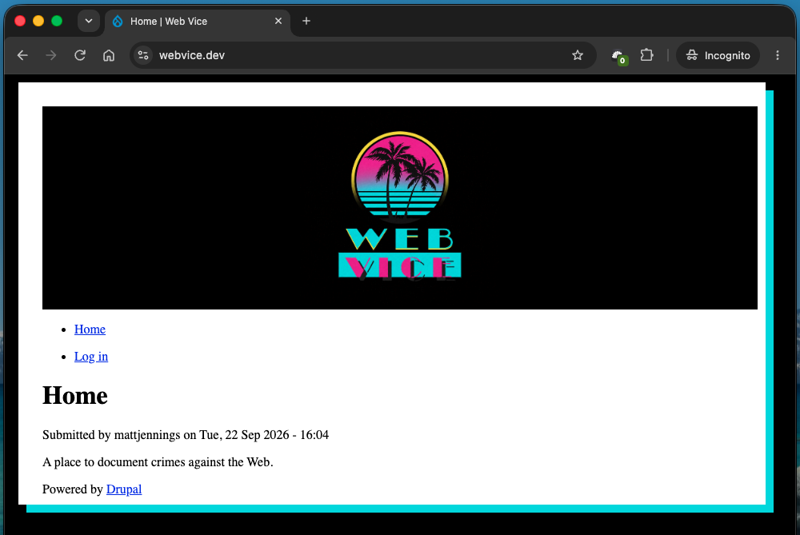

# Drupal with "Web Vice" Theme created by [Matt Jennings](https://www.mattjennings.net/)

1. The "Web Vice" custom Drupal theme is located at `web/themes/custom/webvice` and screenshot is below:
   

2. More Drupal custom themes and modules may be added here in future.

3. See the "Web Vice" custom Drupal theme at [https://webvice.dev/](https://webvice.dev/), which:
   - Was developed via [DDEV](https://ddev.com/) locally on a Mac
   - Is hosted on [AWS Lightsail](https://aws.amazon.com/lightsail/)
   - Has [domain registration via Cloudflare](https://www.cloudflare.com/domains/)
   - Used the [Backup and Migrate Drupal module](https://www.drupal.org/project/backup_migrate) to migrate the database from localhost to remote
